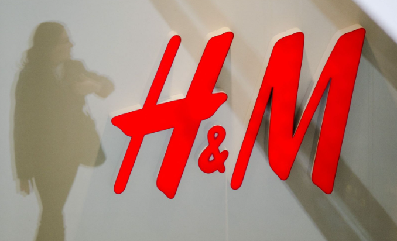

# Reinforcement Learning Regulation Recsys for Kaggle H&M Competition

## Introduction

Xinxin and his team proposed an innovation mechanism to apply Reinforcement Learning as a regulation on supervised learning models for recommend systems [1].  In the newer paper[2], they advanced introduced negative training samples which can eliminate positive bias in the first paper, hence the new models could achieve better performance. The paper's code managed to get State-Of-The-Art performance on RC15[3] and Retailrocket[4] dataset, which are dedicate for recommend system models. However, the recommend system compromise many application environment. We wonder the generalizability of the method. In this project we try to apply the second paper's code on data of a latest Kaggle's competition, [H&M Personalized Fashion Recommendations](https://www.kaggle.com/competitions/h-and-m-personalized-fashion-recommendations) .  Moreover, we implement other algorithms on H&M dataset.   Hence, this data set include our works of two parts: 

- Apply code of *Supervised Advantage Actor-Critic for Recommender Systems* on data from Kaggle H&M competition.
- Build other models for  Kaggle H&M competition.

##  Data

##  Result

## Reference

[1] Xin, Xin, et al. "Self-supervised reinforcement learning for recommender systems." Proceedings of the 43rd International ACM SIGIR Conference on Research and Development in Information Retrieval. 2020.

[2] Xin, Xin, et al. "Supervised Advantage Actor-Critic for Recommender Systems." Proceedings of the Fifteenth ACM International Conference on Web Search and Data Mining. 2022.

[3]  [RecSys 2015 – Challenge – RecSys (acm.org)](https://recsys.acm.org/recsys15/challenge/)

[4] [Retailrocket recommender system dataset | Kaggle](https://www.kaggle.com/datasets/retailrocket/ecommerce-dataset)

